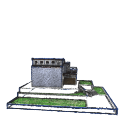
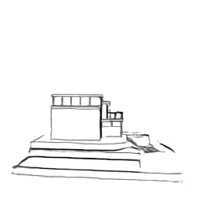
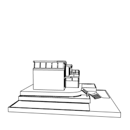
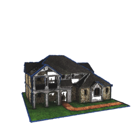
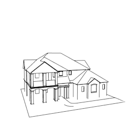
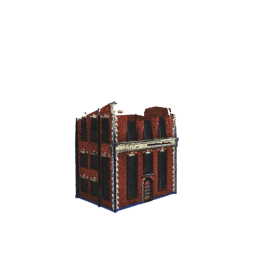
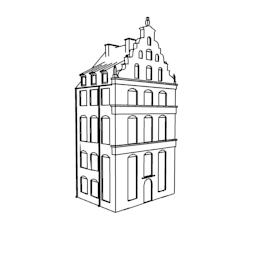

# Voxel-based Network

This network learns to generate stylized views of exactly one point cloud based on known views. 

Example results:

Original View              |  Output | Ground Truth
:-------------------------:|:-------------------------:|:---:
 |  | 
 |  | 
 |  | 

The following (non-default) python packages are needed:
* tensorflow 1.11.0
* pyrr
* imageio (optional, for building gifs)
* plyfile (optional, for voxelizing models)

## Prepare point cloud

The point cloud is expected to be present as numpy array file, which can be generated using `voxelize.py`. 
Place the .ply file with the point cloud in this directory and run it to use the default routine.
The object is expected to be placed within (-0.5 .. 0.5)(-0.5 .. 0.5)(0 .. 1) to work correctly.
The file for the example model in *log/example* is included as *01.npy*

## Train

The known views to train on should be placed in *data/sketch*. 
Note that currently only synthetic known views are supported, which can be rendered using the *randview_x* scripts in *../blender_scripts*.
The training can then be started by running `voxel_network.py`.
Logs and intermediate results are placed in *./log*, and can be visualized using tensorboard.

## Evaluate

A trained model can be applied by feeding in the correct numpy array file and any view matrix.
Find an example evaluation in *eval.py*.
`eval.py` can also be used to run a default evaluation by setting the correct model path in the script. 
Note that pretrained models are not included due to size restrictions. 

## Sources

[1] V. Sitzmann, J. Thies, F. Heide, M. Nießner, G. Wetzstein, and M. Zollhöfer, "Deepvoxels:
Learning persistent 3d feature embeddings,"CoRR, vol. abs/1812.01024, 2018.
[2] Y. Zhou and O. Tuzel, "Voxelnet: End-to-end learning for point cloud based 3d object
detection," CoRR, vol. abs/1711.06396, 2017.
